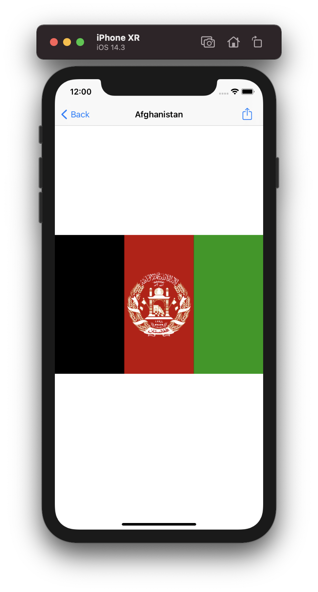

# Milestone 1 (Projects 1-3) - Flags of the World

Using UITableViewController to create a table of flags. Each cell of the table displays an image when pressed. Users have the option to share or save the image.

## Screenshots

  
   
   

