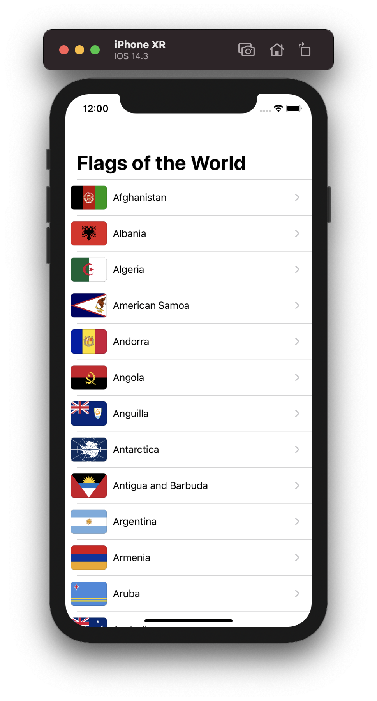

# Milestone 1 (Projects 1-3) - Flags of the World

Using UITableViewController to create a table of flags. Each cell of the table displays an image when pressed. Users have the option to share or save the image.

Flags thanks to https://github.com/emcrisostomo/flags.
Inspired by https://github.com/clarknt/100-days-of-swift/tree/master/04-Milestone-Projects1-3.

## Screenshots

  
   

