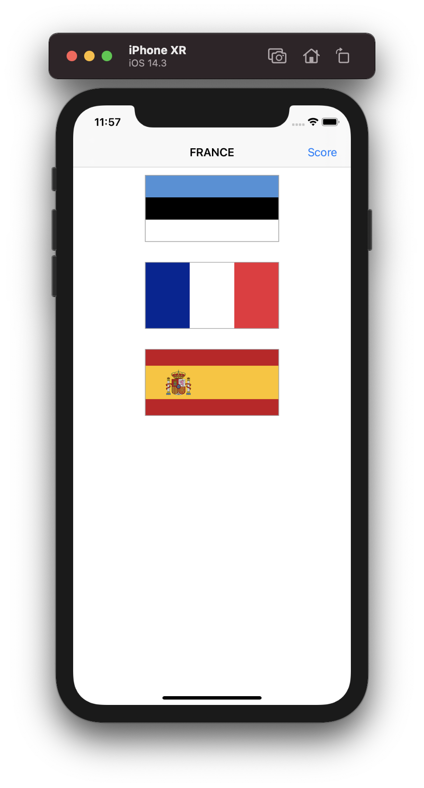
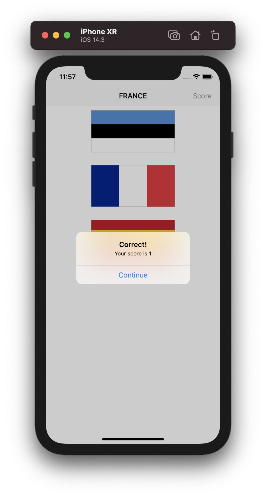
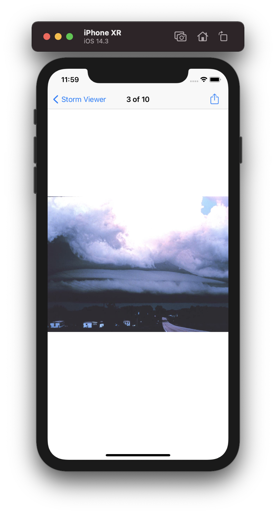
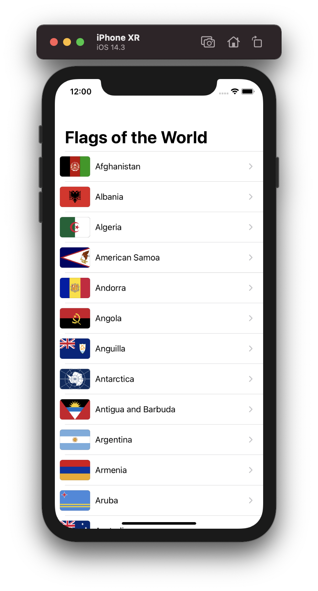
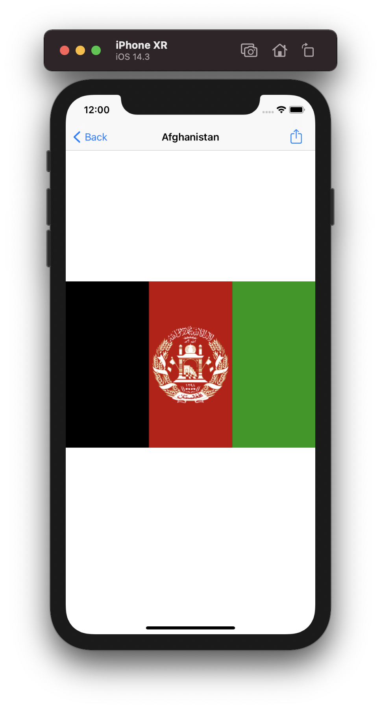

# 100-days-of-swift
Projects from Paul Hudson's 100 Days of Swift: 
https://www.hackingwithswift.com/100

## Table of Contents

Projects                |  Screenshots
---                     |---
[Project 1](Project1) - *Storm Viewer*    View Controllers, Storyboard, FileManager, UIImage  | 
   
 |
[Project 2](Project2) - *Guess the Flag*    UIButton, CALayer, IBAction, UIAlertController | 
   
 |
[Project 3](Project3) - *Social Media*    UIBarButtonItem, UIActivityController  | 
  
 |
[Milestone 1](Milestone1) - *Flags of the World*   |  
   
 |
