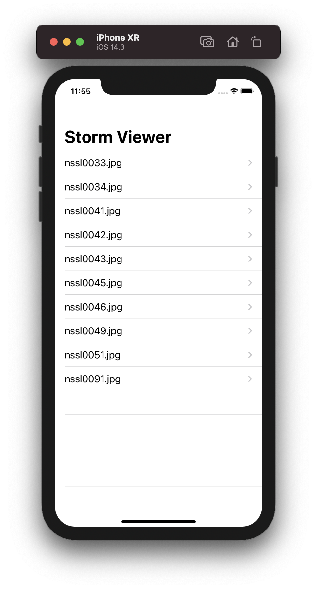
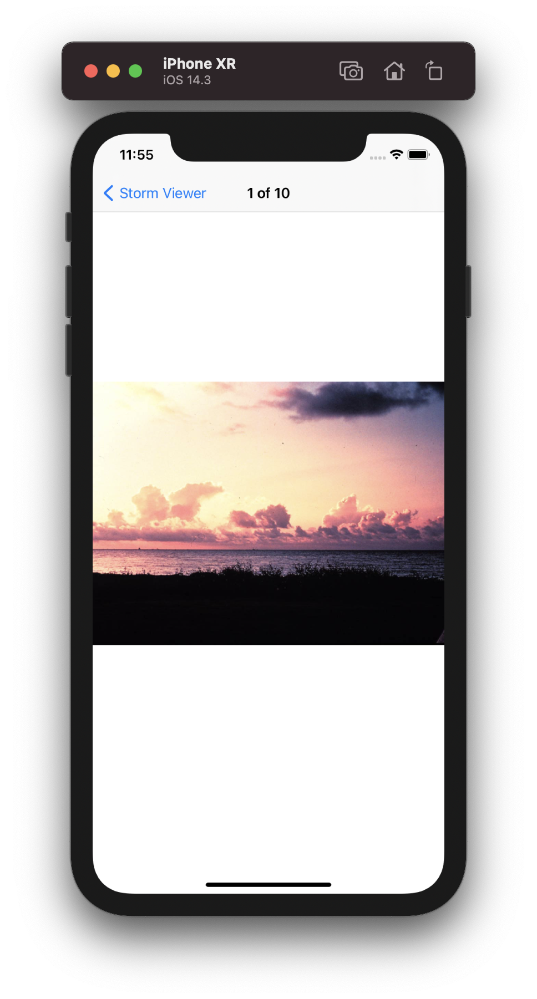

# 100-days-of-swift
Projects from Paul Hudson's 100 Days of Swift: 
https://www.hackingwithswift.com/100

## Preview

Projects / Topics             |  Description                                          | Screenshots
---                           |---                                                    |---
[Project 1](Project1) - *Storm Viewer*   View Controllers, Storyboard, FileManager  | 
Using UITableViewController to create a table of images. Each cell of the table displays an image when pressed. |

  

[Project 2](Project2) - *Guess the Flag*  (with challenges)                                           UIButton, CALayer, IBAction                                              |  |
[Project 3](Project3) - *Social Media*  (with challenges)  (base: project 1)                        UIBarButtonItem, UIActivityController                                    |  |
[Milestone 1](Milestone1) - *Flags of the World*                                                                                                            |   |
